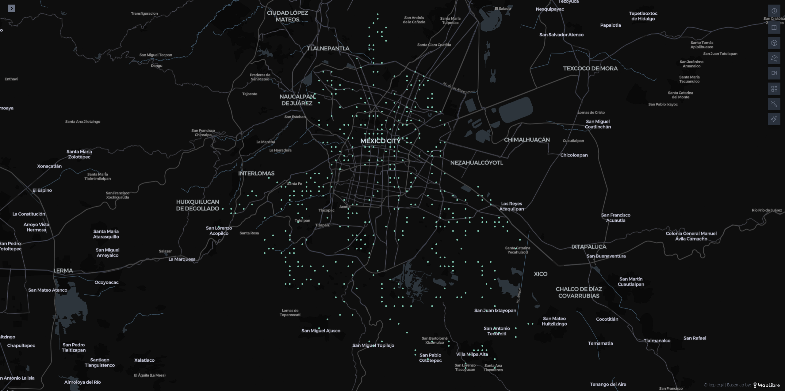
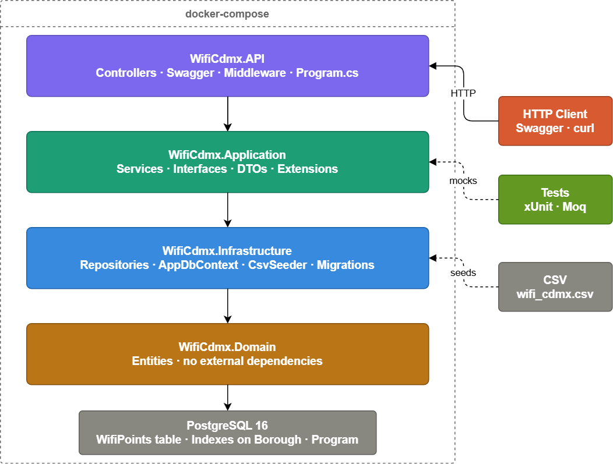

# WiFi CDMX API

REST API for querying public WiFi access points in Mexico City, built with .NET 8 and PostgreSQL.

## Preview

The `/api/wifi-points/heatmap` endpoint returns geographic grid data ready to be visualized with tools like [Kepler.gl](https://kepler.gl/demo).



*Distribution of 35,344 public WiFi access points across Mexico City grouped into geographic grid cells. Denser clusters indicate higher WiFi coverage.*

---

## Table of Contents
- [Architecture](#architecture)
- [Tech Stack](#tech-stack)
- [Project Structure](#project-structure)
- [API Endpoints](#api-endpoints)
- [GraphQL](#graphql)
- [Getting Started](#getting-started)
- [Environment Variables](#environment-variables)
- [Database Schema](#database-schema)
- [Design Decisions](#design-decisions)

---

## Architecture

This project follows **Clean Architecture** with clear separation of concerns across 4 layers:



**Dependency rule:** outer layers depend on inner layers, never the reverse.

---

## Tech Stack

| Layer | Technology |
|---|---|
| Language | C# / .NET 8 |
| Framework | ASP.NET Core Web API |
| Database | PostgreSQL 16 |
| ORM | Entity Framework Core 8 |
| Excel Parsing | ClosedXML |
| Documentation | Swagger / OpenAPI |
| Containerization | Docker + docker-compose |
| Testing | xUnit + Moq |

---

## Project Structure

```
WifiCdmx/
├── WifiCdmx.API/                  # Entry point
│   ├── Controllers/
│   │   └── WifiPointsController.cs
│   ├── Dockerfile
│   ├── Program.cs
│   └── appsettings.json
├── WifiCdmx.Application/          # Business logic
│   ├── DTOs/
│   ├── Interfaces/
│   └── Services/
├── WifiCdmx.Infrastructure/       # Data access
│   ├── Data/
│   ├── Migrations/
│   ├── Repositories/
│   └── Seeders/
├── WifiCdmx.Domain/               # Core entities
│   └── Entities/
├── WifiCdmx.Tests/                # Unit tests
│   └── Services/
├── NuGet.Config
├── data/
│   └── wifi_cdmx.xlsx             # Official CDMX open data dataset
├── docker-compose.yml
├── Makefile
└── .env.example
```

---

## API Endpoints

Base URL: `http://localhost:5000/api`

| Method | Endpoint | Description |
|---|---|---|
| GET | `/wifi-points` | Paginated list of all WiFi points |
| GET | `/wifi-points/{id}` | Single WiFi point by ID |
| GET | `/wifi-points/by-original-id/{originalId}` | Single WiFi point by original dataset ID |
| GET | `/wifi-points/borough/{borough}` | WiFi points filtered by borough |
| GET | `/wifi-points/nearby?lat={}&lon={}` | WiFi points ordered by proximity |
| GET | `/wifi-points/stats` | Aggregated statistics |
| GET | `/wifi-points/heatmap?gridSize=0.01` | Geographic grid cells for heatmap visualization |

### Query Parameters

All list endpoints support:
- `page` (default: 1)
- `pageSize` (default: 20)

### Example Responses

**GET /api/wifi-points**
```json
{
  "data": [
    {
      "id": "0000e4d2-c972-4d8f-9654-197aa3ebac95",
      "originalId": "PILARES_MARCELINO_BUENDIA_AP_01",
      "program": "Pilares",
      "latitude": 19.380467,
      "longitude": -99.069407,
      "borough": "Iztapalapa"
    }
  ],
  "total": 35344,
  "page": 1,
  "pageSize": 20
}
```

**GET /api/wifi-points/stats**
```json
{
  "totalPoints": 35344,
  "totalAccessPoints": 35344,
  "byBorough": [
    { "name": "IZTAPALAPA", "count": 9500 },
    { "name": "ÁLVARO OBREGÓN", "count": 3200 }
  ],
  "byProgram": [
    { "name": "PILARES", "count": 18000 },
    { "name": "Centros_de_Salud", "count": 5000 },
    { "name": "Sitios_Publicos", "count": 4000 }
  ]
}
```

---

## GraphQL

In addition to the REST API, a GraphQL endpoint is available at `POST /graphql` powered by [HotChocolate](https://chillicream.com/docs/hotchocolate).

### Available queries

| Query | Description |
|---|---|
| `wifiPoints(page, pageSize)` | Paginated list of all WiFi points |
| `wifiPointById(id)` | Single WiFi point by Guid |
| `wifiPointsByBorough(borough, page, pageSize)` | WiFi points filtered by borough |
| `nearbyWifiPoints(latitude, longitude, page, pageSize)` | WiFi points ordered by proximity |
| `stats` | Aggregated statistics |
| `heatmap(gridSize)` | Geographic grid cells for heatmap visualization |

### Example queries

**Get total points and breakdown by borough:**
```graphql
{
  stats {
    totalPoints
    totalAccessPoints
    byBorough {
      name
      count
    }
    byProgram {
      name
      count
    }
  }
}
```

**Get first page of WiFi points, selecting specific fields:**
```graphql
{
  wifiPoints(page: 1, pageSize: 5) {
    total
    data {
      name
      borough
      neighborhood
      latitude
      longitude
    }
  }
}
```

**Get nearby points:**
```graphql
{
  nearbyWifiPoints(latitude: 19.4326, longitude: -99.1332, pageSize: 5) {
    total
    data {
      name
      borough
      latitude
      longitude
    }
  }
}
```

**Get heatmap cells:**
```graphql
{
  heatmap(gridSize: 0.01) {
    latitude
    longitude
    pointCount
    totalAccessPoints
  }
}
```

### Banana Cake Pop (GraphQL IDE)

HotChocolate ships with a built-in GraphQL IDE. Open it at:

http://localhost:5000/graphql

---

## Getting Started

### Prerequisites
- Docker Engine or Docker Desktop installed and running
- `make` — optional helper (Linux: `sudo apt install make`, Mac: pre-installed, Windows: not required)

> **Docker Compose note:** Modern Docker versions use `docker compose` (with a space). If you get a `distutils` or `module not found` error with `docker-compose`, use `docker compose` instead. Linux users can upgrade with:
> ```bash
> sudo apt remove docker-compose
> sudo apt install docker-ce docker-ce-cli containerd.io docker-compose-plugin
> ```

### 1. Clone the repository

```bash
git clone https://github.com/nramirez-dev/wifi-cdmx-api.git
cd wifi-cdmx-api
```

### 2. Set up environment variables

**Linux / Mac:**
```bash
cp .env.example .env
```

**Windows (PowerShell):**
```powershell
Copy-Item .env.example .env
```

Open `.env` and set your preferred credentials:
```env
POSTGRES_DB=wifi_cdmx
POSTGRES_USER=postgres
POSTGRES_PASSWORD=your_password_here
```

### 3. Start all services

The dataset is already included in the `data/` folder — no extra steps needed.

**Using make (Linux/Mac):**
```bash
make up
```

**Using docker compose directly (all platforms):**
```bash
docker compose up -d
```

PostgreSQL will start, migrations will run, and 35,344 WiFi points will be seeded automatically.

### 4. Verify the API is running

**Using make:**
```bash
make logs
```

**Using docker compose directly:**
```bash
docker compose logs -f api
```

You should see: `Seeded 35344 WiFi points successfully`

### 5. You are ready!

| Service | URL |
|---|---|
| Swagger UI | http://localhost:5000/swagger |
| GraphQL IDE | http://localhost:5000/graphql |
| REST API | http://localhost:5000/api/wifi-points |

### Available commands

| make | docker compose equivalent | Description |
|---|---|---|
| `make up` | `docker compose up -d` | Start all services |
| `make down` | `docker compose down` | Stop all services |
| `make build` | `docker compose build` | Rebuild Docker images |
| `make logs` | `docker compose logs -f api` | Follow API logs |
| `make clean` | `docker compose down -v` | Remove containers and volumes |

---

## Environment Variables

| Variable | Description | Default |
|---|---|---|
| `POSTGRES_DB` | Database name | `wifi_cdmx` |
| `POSTGRES_USER` | Database user | `postgres` |
| `POSTGRES_PASSWORD` | Database password | — |

---

## Database Schema

### Table: `WifiPoints`

| Column | Type | Description |
|---|---|---|
| `Id` | `uuid` | Primary key — auto-generated Guid |
| `OriginalId` | `varchar(200)` | Original ID from the official CDMX dataset (indexed) |
| `Program` | `varchar(100)` | Installation program — maps to `programa` (indexed) |
| `Borough` | `varchar(100)` | Alcaldía — maps to `alcaldia` (indexed) |
| `Latitude` | `double precision` | Geographic latitude — maps to `latitud` |
| `Longitude` | `double precision` | Geographic longitude — maps to `longitud` |

---

## Bonus Features

### Heatmap Endpoint
`GET /api/wifi-points/heatmap?gridSize=0.01`

Returns WiFi points aggregated into geographic grid cells, ready to feed mapping libraries like Kepler.gl, Leaflet or Google Maps. The `gridSize` parameter controls cell size in degrees (default `0.01` ≈ 1km²).

### Stats Endpoint
`GET /api/wifi-points/stats`

Returns aggregated statistics across the full dataset — total points, total access points, and breakdowns by borough and program. Useful for dashboards and data exploration.

### Functional Programming
Functional programming principles were applied throughout: pure static mapping functions (`ToDto`, `ToPagedResult`), immutable DTOs using C# records, and LINQ method chaining for data transformations instead of imperative loops.

---

## Design Decisions

**Why PostgreSQL over NoSQL?**
The dataset has a fixed schema and benefits from indexed queries on `Borough` and `Program`. SQL fits naturally.

**Why Haversine instead of PostGIS?**
PostGIS adds operational overhead. For 35,344 points, Haversine calculated by EF Core is efficient enough and keeps the stack lean.

**Why Guid as primary key?**
The official dataset uses descriptive string IDs (e.g. `PILARES_MARCELINO_BUENDIA_AP_01`) which break URL routing. Guid keeps the API clean while the original ID is preserved in the `OriginalId` field and exposed via a dedicated endpoint.

**Why Clean Architecture?**
Each layer has a single responsibility. The service layer is fully unit-testable with mocked repositories — no database required to run tests.

**Why functional patterns in WifiPointService?**
`MapAsync`, curried functions and pattern matching replace imperative null checks and loops. These patterns map directly to concepts in typed functional languages.

**Why a Heatmap endpoint?**
A data company needs to visualize data. This endpoint returns pre-aggregated geographic grid cells ready for Kepler.gl, Leaflet or Google Maps — no client-side aggregation needed.

**Why auto-seed on startup?**
Zero manual steps. `docker compose up` creates the database, runs migrations and loads 35,344 WiFi points from the official CDMX Excel dataset automatically.

**Why a GetByOriginalId endpoint?**
The official CDMX dataset uses descriptive string IDs (e.g. `PILARES_MARCELINO_BUENDIA_AP_01`). This endpoint allows consumers to cross-reference data directly with the government open data portal without needing to search by coordinates or paginate through results.
